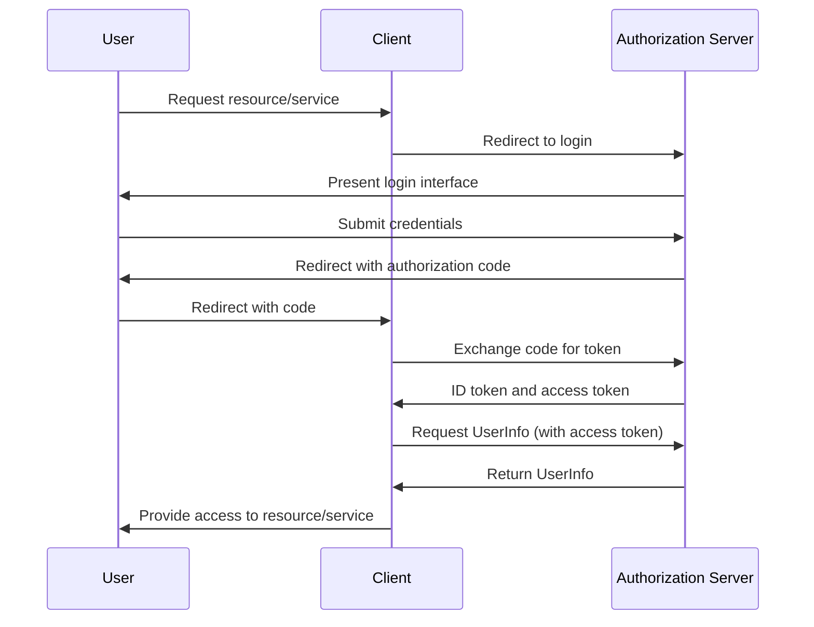

| [README](../../README.md) | OpenID Connect (OIDC) | [run-s](run-s.md) | [run-p](run-p.md) | [Node API](node-api.md) |
|-----------------------|-------------|-------------------|-------------------|-------------------------|

OpenID Connect (OIDC) is an authentication layer on top of the OAuth 2.0 protocol. It allows clients to verify the identity of an end-user based on the authentication performed by an authorization server, as well as to obtain basic profile information about the end-user in an interoperable and REST-like manner. OIDC uses JSON Web Tokens (JWTs) to securely pass the identity information between the identity provider (IdP) and a client.

Here's a detailed explanation of the OIDC flow with a sequence diagram:

1. **User Authentication Request**: The user initiates the process by attempting to access a resource or service that requires authentication. The client (such as a web application) then redirects the user to the authorization server (IdP).

2. **Authorization Server Login**: The authorization server presents a login interface to the user. The user submits their credentials (like username and password) to the authorization server.

3. **Authorization Code Grant**: After successful authentication, the authorization server redirects the user back to the client with an authorization code. This redirection is done to a predefined callback URL.

4. **Token Request**: The client sends a request to the token endpoint of the authorization server with the authorization code and its own credentials.

5. **Token Response**: If the authorization code is valid, the authorization server responds with an ID token and an access token. The ID token is a JWT that contains identity information about the user.

6. **UserInfo Request (Optional)**: The client can send a request to the UserInfo endpoint with the access token to get more detailed user profile information.

7. **UserInfo Response (Optional)**: The authorization server returns the requested user profile information.

Here is a sequence diagram illustrating this process:

This process ensures that the user's credentials are only known to the authorization server, and the client only receives tokens that are proof of the user's authentication and consent. OIDC is widely used for single sign-on (SSO) and for enabling applications to securely authenticate users.
